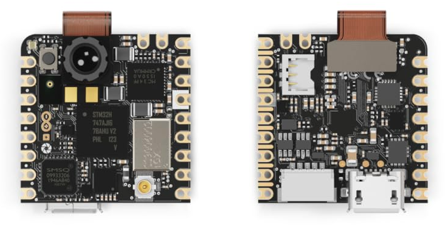

# :star: Nicla Vision Drivers :star:
Plug-and-play MicroPython drivers for Arduino Nicla Vision sensors.



-------------------

## Description

This package contains the MicroPython drivers enabling the [Arduino Nicla Vision](https://docs.arduino.cc/hardware/nicla-vision/) board to be ready-to-use in the ROS world! :boom:

The developed MicroPython script allows for streaming of sensors data from the Arduino Nicla Vision board to a ROS-running machine via TCP or UDP sockets. 
This package provide the optimised drivers that will be running on the Nicla Vision board, allowing to:
- connect the board to a WiFi,
- start a TCP/UDP socket stream,
- sense all the sensors,
- serialize the sensors data,
- send the sensors data through the socket.

Here a list of the available sensors onboard the Arduino Nicla Vision board:
- **2MP color camera** 
- **Time-of-Flight (distance) sensor**  
- **Microphone**  
- **Imu**

## Table of Contents 
1. [Installation](#installation)
2. [Usage](#usage)
3. [Package List](#package-list)
4. [Video](#video-demonstration)
5. [License](#license)
6. [Cite](#citation)
   
-------------------

# Installation
Step-by-step instructions on how to get the drivers running onboard the Arduino Nicla Vision:

1. Connect the board to the pc.
2. If it is your first time with the board, please follow the [Getting Started tutorial here](https://docs.arduino.cc/tutorials/nicla-vision/getting-started/), for getting the latest available firmware of the board through OpenMV IDE.
3. Download the `scripts/main.py` and `scripts/config.json` files of this repository 
5. Copy the `main.py` and `config.json` files ìnside the memory of the Nicla Vision board.
6. Reboot the board (unplug and plug again the board to the pc)

# Usage 
Follow the below two steps for enjoying your Arduino Nicla Vision board! 🚀

1. Turn on a Hotspot connection on your pc.
   
   **Note:** if you are on Ubuntu, click on Settings->WiFi->top three dots->"Turn on WiFi Hotspot...". If "Turn on WiFi Hotspot..." is grayed out, click first on the Network tab and then follow       again the procedure starting from the WiFi tab. If the Hotspot is already configured, run this command in a terminal: `$ nmcli connection up Hotspot`
   
2. `$ ifconfig` on your pc, and copy the "inet" address under the "enp" voice (following point)
3. Set the parameters in the `config.json` file:
   - `ssid`: the name of the activated Hotspot
   - `password`: the password of the activated Hotspot
   - `ip`: IP address copied at point 2.
   - `connection_type`: "tcp" or "udp" (the user can choose if the board should transmit the sensors data by UDP or TCP socket connection)
   - `verbose`: true or false (for visualizing some debug prints in OpenMV IDE) 
4. Run the `main.py`:
   - just turn on the board (e.g. connecting it to the pc)
   - using OpenMV IDE ([Getting Started tutorial here](https://docs.arduino.cc/tutorials/nicla-vision/getting-started/))
  
   **Note:** Look at the LED of your board! The first seconds (about 15 sec) after having turned it on, the LED should be Blue.
      - When the board is correctly connected and it is streaming, the LED will turn off.
      - If you are having connection issues, the LED will be Blue again.
      - If during execution you see a Green LED, it is for unforseen errors.
      - If during execution you see a Red LED, it is for memory errors (usually picture quality too high).

:sunny: Now you are ready to go!
Check out the [Nicla Vision ROS2 repository](https://github.com/ADVRHumanoids/nicla_vision_ros2.git) or the [Nicla Vision ROS repository](https://github.com/ADVRHumanoids/nicla_vision_ros.git) for unlocking the Nicla Vision board in the ROS ecosystem! :sunny:

# Video Demonstration

https://github.com/ADVRHumanoids/nicla_vision_ros2/assets/63496571/247952a0-86cb-4514-a034-d8736c8b70ba

# Package List
Here some useful links:

- [Nicla Vision Drivers repository](https://github.com/ADVRHumanoids/nicla_vision_drivers.git)
- [Nicla Vision ROS repository](https://github.com/ADVRHumanoids/nicla_vision_ros.git)
- [Nicla Vision ROS2 repository](https://github.com/ADVRHumanoids/nicla_vision_ros2.git)

# License
Distributed under the Apache-2.0 License. See LICENSE for more information.

# Citation 
:raised_hands: If you use this work or take inspiration from it, please cite (publication in progress):
```bash
@inproceedings{delbianco2024dagana,
  title={},
  author={},
  booktitle={},
  year={}
}
```
